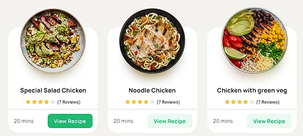

# Recipe Management Web Server

A web application for managing and exploring recipes, built with Node.js and Express, using MySQL for data storage.

## Getting Started

### Prerequisites
- Node.js
- MySQL/MariaDB
- Xampp/Wampp (optional)

### Installation

1. **Configure Environment Variables**
Create a `.env` file with:
```
PORT=8800
DB_HOST=localhost
DB_NAME=your_db_name
DB_USER=your_db_user
DB_PASSWORD=your_db_password
DB_DATABASE=gestao_receitas
SECRETKEY=your_secret_key
```

2. **Install Dependencies**
```bash
npm install --save
```

3. **Setup Database**
Execute the SQL script at `db/gestao_receitas.sql`

4. **Start Server**
```bash
npm start        # Production
# or
nodemon app      # Development
```

## Test Account
- Email: admin@gestao.receitas
- Password: Admin123

### **Website Map - Recipe Management**

#### **Frontoffice (End Users)**
1. **Home Page**
   - Highlights: Popular or new recipes (retrieved via API).
   - Search: Search bar with filters (name, category, difficulty, etc.).

2. **Explore Recipes**
   - Recipe listing by category (starters, main courses, desserts, etc.).
   - Additional filters (preparation time, cost, difficulty).
   - Information is displayed from the API.

3. **Recipe Details**
   - Recipe name, image, author, ingredient list, preparation steps.
   - Additional information: time, cost, difficulty, category.
   - Buttons: Mark as favorite, add to a collection, share.
   - Data is exclusively retrieved via the API.

4. **Favorites and Collections**
   - List of favorite recipes (stored in the local database).
   - Manage personalized recipe collections.

5. **User Profile**
   - Personal information.
   - Manage preferences (e.g., favorite categories).
   - Logout.

#### **Backoffice (Administrators)**
1. **Dashboard**
   - Overview: Total users, favorite recipe categories, etc.

2. **Ingredient Management**
   - List, add, edit, and delete ingredients (local, used for personalized functionalities like favorite collections).

3. **Local Categories Management**
   - List, add, edit, and delete categories (to structure collections or preferences).

4. **User Management**
   - List, add, edit, delete users.
   - Manage permissions.

#### **Extra Features**
1. **Authentication**
   - Login/registration (including via Google).
   - Password recovery.

2. **External API Integration**
   - Import recipes and synchronize with the application.
   - The API is the sole source of recipe data.

3. **Advanced Search**
   - Detailed filters: Specific ingredients, preparation time, etc. (based on API capabilities).

## Architecture

### Models
- mealModel
- categoryModel

### Controllers
- mealController
- categoryController

### API Integration
- Categories: `www.themealdb.com/api/json/v1/1/categories.php`
- Filter by category: `www.themealdb.com/api/json/v1/1/filter.php?c=Seafood`

### Project Structure

#### Models
- [mealModel.js](models/mealModel.js) - External API integration for recipe data
- [userModel.js](models/userModel.js) - User account management
- [favoriteModel.js](models/favoriteModel.js) - User's favorite recipes
- [collectionModel.js](models/collectionModel.js) - User's recipe collections
- [categoryModel.js](models/categoryModel.js) - Recipe categories management

#### Controllers
- [mealController.js](controllers/mealController.js) - Recipe management and search
- [userController.js](controllers/userController.js) - User authentication and profile
- [favoriteController.js](controllers/favoriteController.js) - Favorite recipes management
- [collectionController.js](controllers/collectionController.js) - Collections management
- [adminController.js](controllers/adminController.js) - Admin dashboard and management

#### Routes
- API Routes
  - [api/recipes.js](routes/api/recipes.js) - Recipe endpoints
  - [api/favorite.js](routes/api/favorite.js) - Favorite management
  - [api/collections.js](routes/api/collections.js) - Collection management
  - [api/validations.js](routes/api/validations.js) - Input validation

- Auth Routes
  - [auth/login.js](routes/auth/login.js) - User login
  - [auth/register.js](routes/auth/register.js) - User registration
  - [auth/verifyToken.js](routes/auth/verifyToken.js) - JWT authentication

- Recipe Routes
  - [recipes/explorer.js](routes/recipes/explorer.js) - Recipe exploration
  - [recipes/recipeDetails.js](routes/recipes/recipeDetails.js) - Recipe details
  - [recipes/favorites.js](routes/recipes/favorites.js) - Favorites page
  - [recipes/myCollections.js](routes/recipes/myCollections.js) - Collections page

- Admin Routes
  - [admin/admin.js](routes/admin/admin.js) - Admin dashboard

#### Views
- Authentication
  - [auth/login.ejs](views/auth/login.ejs) - Login form
  - [auth/register.ejs](views/auth/register.ejs) - Registration form

- Recipe Views
  - [recipes/explorer.ejs](views/recipes/explorer.ejs) - Recipe exploration page
  - [recipes/recipeDetails.ejs](views/recipes/recipeDetails.ejs) - Recipe details page
  - [recipes/favorites.ejs](views/recipes/favorites.ejs) - Favorites page
  - [recipes/collections.ejs](views/recipes/collections.ejs) - Collections page
  - [recipes/categories.ejs](views/recipes/categories.ejs) - Categories page
  - [recipes/recipesCards/card.ejs](views/recipes/recipesCards/card.ejs) - Recipe card component
  - [recipes/recipesCards/cardsContainer.ejs](views/recipes/recipesCards/cardsContainer.ejs) - Grid container
  - [recipes/recipesCards/cardsScrollListContainer.ejs](views/recipes/recipesCards/cardsScrollListContainer.ejs) - Horizontal scroll

- Admin Views
  - [admin/dashboard.ejs](views/admin/dashboard.ejs) - Admin dashboard

- Shared Components
  - [templates/htmlTemplate.ejs](views/templates/htmlTemplate.ejs) - Base HTML template
  - [modules/upperNavBar.ejs](views/modules/upperNavBar.ejs) - Navigation bar
  - [modules/footer.ejs](views/modules/footer.ejs) - Footer component

- Core Pages
  - [index.ejs](views/index.ejs) - Homepage
  - [dashboard.ejs](views/dashboard.ejs) - User dashboard

## Design

### Brand
- **Primary Color**: #f39342 (RGB 243, 147, 66)
- **Secondary Color**: #ffffff (RGB 255, 255, 255)

### Logo


### Elements & Components

##### Example for the design of cards:


## Authors
- André Silva
- Gonçalo Ferreira
- Samuel Santos
